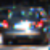
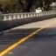
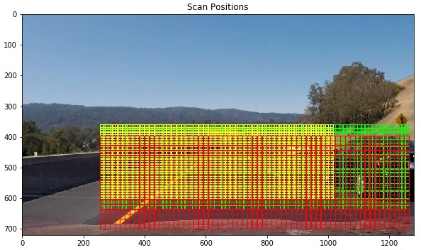
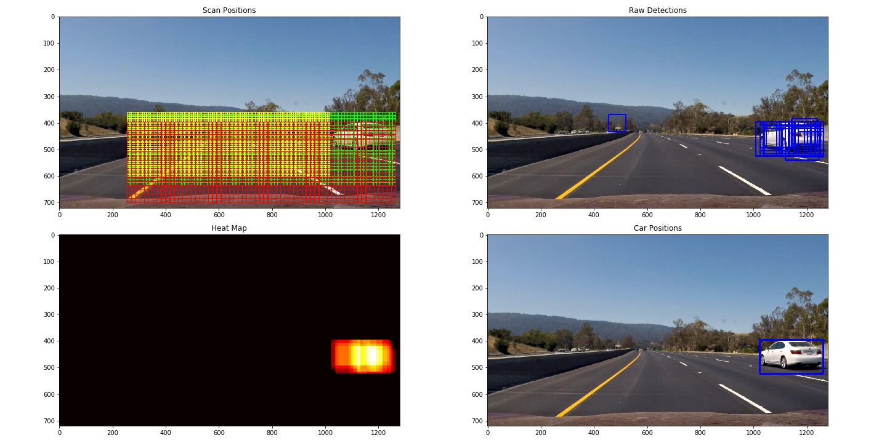
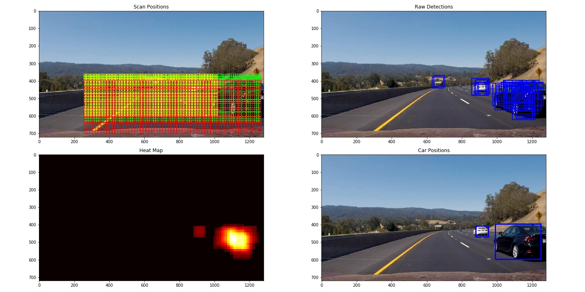
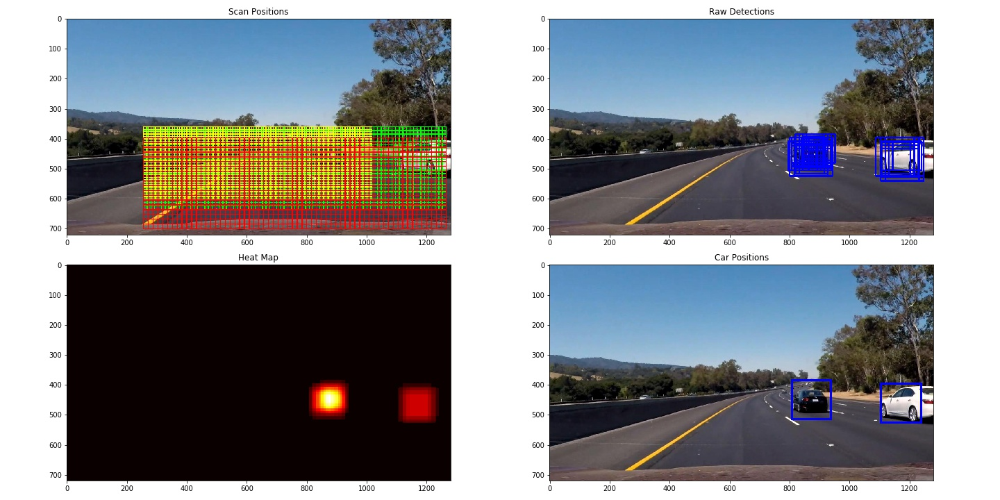

# Vehicle Detection Project

The goals / steps of this project are the following:

* Perform a Histogram of Oriented Gradients (HOG) feature extraction on a labeled training set of images and train a classifier Linear SVM classifier
* Optionally, you can also apply a color transform and append binned color features, as well as histograms of color, to your HOG feature vector. 
* Note: for those first two steps don't forget to normalize your features and randomize a selection for training and testing.
* Implement a sliding-window technique and use your trained classifier to search for vehicles in images.
* Run your pipeline on a video stream (start with the test_video.mp4 and later implement on full project_video.mp4) and create a heat map of recurring detections frame by frame to reject outliers and follow detected vehicles.
* Estimate a bounding box for vehicles detected.

[//]: # (Image References)
[image1]: ./examples/car_not_car.png
[image2]: ./examples/HOG_example.jpg
[image3]: ./examples/sliding_windows.jpg
[image4]: ./examples/sliding_window.jpg
[image5]: ./examples/bboxes_and_heat.png
[image6]: ./examples/labels_map.png
[image7]: ./examples/output_bboxes.png
[video1]: ./project_video.mp4

## [Rubric](https://review.udacity.com/#!/rubrics/513/view) Points

Here I will consider the rubric points individually and describe how I addressed each point in my implementation.

---
### Writeup / README

#### 1. Provide a Writeup / README that includes all the rubric points and how you addressed each one.  You can submit your writeup as markdown or pdf.  [Here](https://github.com/udacity/CarND-Vehicle-Detection/blob/master/writeup_template.md) is a template writeup for this project you can use as a guide and a starting point.

You're reading it!

### Histogram of Oriented Gradients (HOG)

#### 1. Explain how (and identify where in your code) you extracted HOG features from the training images.

The code for this step is contained in the code cell titled HOG Classifier in the IPython notebook [vehicle-detection.ipynb](vehicle-detection.ipynb)

I started by reading in all the `vehicle` and `non-vehicle` images.  Here is an example of one of each of the `vehicle` and `non-vehicle` classes:

`vehicle`



`non-vehicle`



I then explored different color spaces and different `skimage.hog()` parameters (`orientations`, `pixels_per_cell`, and `cells_per_block`).

#### 2. Explain how you settled on your final choice of HOG parameters.
#### 3. Describe how (and identify where in your code) you trained a classifier using your selected HOG features (and color features if you used them).

I trained a linear SVM classifier to classify car and non-car images. The training data set is split into 80% and 20% for training and validation.

The validation set accuracy is used as a guide to choose various parameters as listed below:

````python
colorspace = 'YCrCb' # Can be RGB, HSV, LUV, HLS, YUV, YCrCb
orient = 9  # HOG orientations
pix_per_cell = 8 # HOG pixels per cell
cell_per_block = 2 # HOG cells per block
hog_channel = "ALL" # Can be 0, 1, 2, or "ALL"
spatial_size = (16, 16) # Spatial binning dimensions
hist_bins = 16    # Number of histogram bins
spatial_feat = True # Spatial features on or off
hist_feat = True # Histogram features on or off
hog_feat = True # HOG features on or off
````

In the choice of color space, it appeared that YCrCb and HSV performed the best. The above set of parameters achieved an accuracy of 98.96%

A few things would further improve accuracy to 99.58%, they include using `spatial_size=(32,32)`, `hist_bins=32` and using a 3rd order RBF kernel in SVM classifier.
But I decided not to use them due to substantially more computation overhead.


### Sliding Window Search

#### 1. Describe how (and identify where in your code) you implemented a sliding window search.  How did you decide what scales to search and how much to overlap windows?

I followed the sub-sampling method in the course material. I started with having a large window scan and gradually added more and more smaller windows.

Each of the scan/search is specified with a region of interest (i.e. a set of coordinates `xstart, xstop, ystart, ystop`) in function find_car()

I extracted 28 frames from the project_video.mp4. Using these images along with the original 6 test images I tuned the window sizes/scales and window overlap.

#### 2. Show some examples of test images to demonstrate how your pipeline is working.  What did you do to optimize the performance of your classifier?

Ultimately I searched on 3 scales using YCrCb 3-channel HOG features plus spatially binned color and histograms of color in the feature vector, which provided a nice result.

The following image illustrates the scanning pattern and window sizes (with `cells_per_step=1`)



The yellow region is scanned with `scale=1.0`, the green region is scanned with `scale=1.5` and the red region is canned with `scale=2.0`.

The code implemented this is in cell 21 and cited below:

````python
    bbox_list = []
    scan_list = []
    img = mpimg.imread(i)

    scan_img = np.copy(img)

    xstart = int(img.shape[1]*.2)
    xstop = int(img.shape[1]*1.0)
    ystart = int(img.shape[0]*.50)
    ystop = int(img.shape[0]*0.9)
    scale = 1.5
    b_list, s_list = find_cars(img, xstart, xstop, ystart, ystop, scale, svc, X_scaler, orient, pix_per_cell, cell_per_block, spatial_size, hist_bins,
                              cells_per_step=1)
    bbox_list = bbox_list + b_list
    scan_list = scan_list + s_list

    draw_boxes(scan_img, s_list, thickness=2, c=(0,255,0))


    xstart = int(img.shape[1]*.2)
    xstop = int(img.shape[1]*.8)
    ystart = int(img.shape[0]*.5)
    ystop = int(img.shape[0]*.85)
    scale = 1.0
    b_list, s_list = find_cars(img, xstart, xstop, ystart, ystop, scale, svc, X_scaler, orient, pix_per_cell, cell_per_block, spatial_size, hist_bins,
                              cells_per_step=1)
    bbox_list = bbox_list + b_list
    scan_list = scan_list + s_list

    draw_boxes(scan_img, s_list, thickness=2, c=(255,255,0))


    xstart = int(img.shape[1]*.2)
    xstop = int(img.shape[1]*1.0)
    ystart = int(img.shape[0]*.55)
    ystop = int(img.shape[0]*1.0)
    scale = 2.0
    b_list, s_list = find_cars(img, xstart, xstop, ystart, ystop, scale, svc, X_scaler, orient, pix_per_cell, cell_per_block, spatial_size, hist_bins,
                              cells_per_step=1)
    bbox_list = bbox_list + b_list
    scan_list = scan_list + s_list

    draw_boxes(scan_img, s_list, thickness=2, c=(255,0,0))
````


Here are some example images showing the results (scanning pattern, raw detection, heatmap, and car position):








---

### Video Implementation

#### 1. Provide a link to your final video output.  Your pipeline should perform reasonably well on the entire project video (somewhat wobbly or unstable bounding boxes are ok as long as you are identifying the vehicles most of the time with minimal false positives.)
Here's a [link to my video result](./project_video_output.mp4)


#### 2. Describe how (and identify where in your code) you implemented some kind of filter for false positives and some method for combining overlapping bounding boxes.

I recorded the positions of positive detections in each frame of the video.
From the positive detections I created a heatmap and then thresholded (with `threshold=2`) that map to identify vehicle positions.
I then used `scipy.ndimage.measurements.label()` to identify individual blobs in the heatmap.
I then assumed each blob corresponded to a vehicle. I constructed bounding boxes to cover the area of each blob detected.

A few examples are shown above, more examples are available in test_images folder with filenames such as result_project_*.jpg

---

### Discussion

#### 1. Briefly discuss any problems / issues you faced in your implementation of this project.  Where will your pipeline likely fail?  What could you do to make it more robust?

A few areas can certainly use some improvements:

* Implementing some sort of contrast enhancement / equalization might improve classification accuracy
* Average over several frames could probably stabilize the bounding box and help reject false positive.
* In addition, currently the processing of the video takes a long time. If tracking is implemented I wonder if we can significantly reduce the area to scan (though, how do we avoid missing cars appearing in positions not previously seen?)
* The vehicle far ahead could not be detected, one reason is that the car color blends into the road quite well. The 2nd reason I think is that we don't have enough training examples for such gray cars with low resolution.
